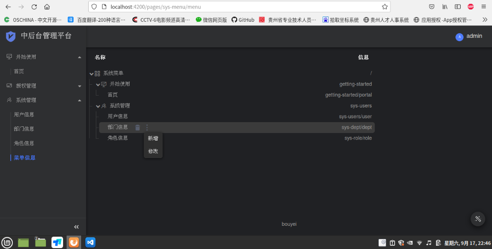

# rustms 一款中后台管理系统

#### Description

一款基于后端基于rust语言开发的的中后台管理系统模板，高性能的后端+精美的沉浸式用户界面体验效果。
后端服务直接托管前端html代码，无需再为前端额外安装nginx等服务。
功能包括最基本的：菜单配置、角色配置、部门管理、用户管理等。
提供新手快速参考学习。

#### Software Architecture
##### 后端:rust 1.60版本;actix-web 4.0;postgresql数据库;
##### 前端:angular 12;devui(ng-devui-admin)前端模板;

#### Installation

1.  安装配置好rust开发环境，建议最新语言1.60或以上版本，并安装cargo;项目使用cargo编译调试。
2.  配置安装好angular开发环境，具体详细看angular配置。
3.  配置好postgresql数据库环境。
4.  git https://gitee.com/bouyei/rustms.git 下载项目。
5.  推荐使用vscode开发调试。
6.  开发调试前端启动:ng serve(代理启动 ng serve --proxy-config proxy.conf.json);后端启动cargo run,项目自动还原依赖。

#### Instructions

1.  找到sql文件夹的脚本进行数据库创建。
2.  使用cargo build --release发布后端程序，找到target/release里面就是发布发布程序。
3.  使用ng buid命令编译发布前端页面，再在dist文件夹找到包含index.html的所有文件直接拷贝到target/release的resources/pages(没有就创建)里面。
4.  在target/release文件夹里面找到conf文件夹(没有就创建)settings.json修改数据库配置和监听端口。
5.  前端修改config/settings.ts的地址为"/"。
6.  访问地址如:http://localhost:4200/index.html

#### Preview Effect
##### 界面预览截图效果：

!
[用户编辑](doc/user.png)
